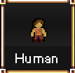
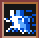
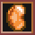
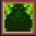

## 人类

技能 | 图鉴 | 施放 | 说明
--|--|--|--
追赶猎物 |  | 技能 | 长按增加10SPD,消耗能量
点火 |  | 技能| 可以点燃火把和灯具
顶尖猎手 |  |被动| 20%掉落蓝色经验x2

## 矮人

技能 | 图鉴 | 施放 | 说明
--|--|--|--
硬如钢铁 |  |被动| 每点DEF增加10健康值
驱逐舰 |  |被动| 没有光时也能看到宝物
刻意步伐 |  |被动| 忽略护甲导致的移动速度惩罚

## 精灵

技能 | 图鉴 | 施放 | 说明
--|--|--|--
奇妙速度 |   | 技能| 0.5秒内增加10速度
夜鸱 |  |被动| 黑暗中也能休息,远程攻击不受黑暗影响
灵动步伐 |  |被动| 每4DEX获得1SPD

## 傻猩

技能 | 图鉴 | 施放 | 说明
--|--|--|--
心大 |   | 被动| 基础CON和STR会互相累加到对方
很笨 |  |被动| STR会降低INT
胃大 |  |被动| 最大饥饿值翻倍

## 地悍

技能 | 图鉴 | 施放 | 说明
--|--|--|--
朽角 |   | 技能 | 冲刺攻击,100%STR伤害,200%的击退效果
粗糙皮肤 |  | 被动 | 每STR获得1DEF
四个胃 |  | 被动 | 不休息也会转化饥饿度为健康值

## 沼泽人

技能 | 图鉴 | 施放 | 说明
--|--|--|--
巨大 |   | 被动 | 每STR获得5健康值
苔藓蔓延 |  | 被动 | 在水中恢复健康值
一团乱麻 |  | 被动 | 受到的伤害减半