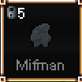

## 人类

技能 | 图鉴 | 施放 | 说明
--|--|--|--
追赶猎物 |  | 主动 | 长按增加10SPD,消耗能量
点火 |  | 主动| 可以点燃火把和灯具
顶尖猎手 |  |被动| 20%掉落蓝色经验x2

## 矮人

技能 | 图鉴 | 施放 | 说明
--|--|--|--
硬如钢铁 |  |被动| 每点DEF增加10健康值
驱逐舰 |  |被动| 没有光时也能看到宝物
刻意步伐 |  |被动| 忽略护甲导致的移动速度惩罚

## 精灵

技能 | 图鉴 | 施放 | 说明
--|--|--|--
奇妙速度 |   | 主动| 0.5秒内增加10速度
夜鸱 |  |被动| 黑暗中也能休息,远程攻击不受黑暗影响
灵动步伐 |  |被动| 每4DEX获得1SPD

## 傻猩

技能 | 图鉴 | 施放 | 说明
--|--|--|--
心大 |   | 被动| 基础CON和STR会互相累加到对方
很笨 |  |被动| STR会降低INT
胃大 |  |被动| 最大饥饿值翻倍

## 地悍

技能 | 图鉴 | 施放 | 说明
--|--|--|--
朽角 |   | 主动 | 冲刺攻击,100%STR伤害,200%的击退效果
粗糙皮肤 |  | 被动 | 每STR获得1DEF
四个胃 |  | 被动 | 不休息也会转化饥饿度为健康值

## 沼泽人

技能 | 图鉴 | 施放 | 说明
--|--|--|--
巨大 |   | 被动 | 每STR获得5健康值
苔藓蔓延 |  | 被动 | 在水中恢复健康值
一团乱麻 |  | 被动 | 受到的伤害减半

## 腐臭球

技能 | 图鉴 | 施放 | 说明
--|--|--|--
生化囊 |   | 被动 | 走过地面留下酸性液体,造成CON伤害
生化喷洒 |  | 被动 | 在水中恢复健康值
生化痰吐 |  | 主动 | 吐出酸性液体

## 聒噪人

技能 | 图鉴 | 施放 | 说明
--|--|--|--
扭曲恐惧 |   | 被动 | 每级损失CHM
扭曲肉体 |  | 被动 | 受伤3秒后恢复DEX的健康值
扭曲聒噪 |  | 主动 | 吟唱时击晕所有人

## 传话人

技能 | 图鉴 | 施放 | 说明
--|--|--|--
射频头 |   | 被动 | 可以使用无限能量
无线耳机 |  | 主动  | 用能量轰炸,击晕并持续造成伤害
千里眼 |  | 被动 | 附近敌人无法恢复生命

## 血领主

技能 | 图鉴 | 施放 | 说明
--|--|--|--
匕首 |   | 主动 | 放出鲜血突刺,造成50%CON伤害
割伤 |  | 被动 | 攻击敌人造成对方流血.流血能恢复自己健康值
血咒 |  | 被动 | 每级提升1CHM

## 圆牙

技能 | 图鉴 | 施放 | 说明
--|--|--|--
智齿 |   | 被动 | 每次击杀获得一个牙齿,每个牙齿降低1CHM
虐齿 |  | 被动 | 每颗牙增加1STR
甜齿 |  | 被动 | 每颗牙增加1ENG

## 脆腿

技能 | 图鉴 | 施放 | 说明
--|--|--|--
恐怖研磨 |   | 被动 | 每级降低1CHM
肉体研磨 |  | 被动 | 受伤3秒后恢复STR的健康值
钩挂研磨 |  | 主动 | 冲刺攻击,100%STR伤害,拖着敌人前行造成10%STR/0.1秒

## 大长腿

技能 | 图鉴 | 施放 | 说明
--|--|--|--
大步走 |   | 被动 | SPD和STR会互相累加到对方
天生长腿 |  | 被动 | 不受水中减速影响
跳步 |  | 被动 | 移动时获得双倍SPD

## 棘刺人

技能 | 图鉴 | 施放 | 说明
--|--|--|--
棘刺爆发 |   | 主动 | 造成DEF伤害并施加中毒
浪漫结局 |  | 被动 | 受到伤害时激活`棘刺爆发`
藤蔓纠缠 |  | 被动 | 减速受伤的敌人

## 河流人

技能 | 图鉴 | 施放 | 说明
--|--|--|--
河流之魂 |   | 被动 | 湿润下所有状态翻倍
创造河流 |  | 主动 | 清除`软墙`得到`瓦砾`
创造湖泊 |  | 主动 | 用`瓦砾`建造`软墙`

## 锡安人

技能 | 图鉴 | 施放 | 说明
--|--|--|--
习惯偷窃 |   | 被动 | 接触敌人时有DEX的几率偷窃物品
无辜逃脱 |  | 被动 | 受到伤害时速度翻倍
敏锐眼神 |  | 被动 | 钱币数量翻倍

## 熔岩巨人

技能 | 图鉴 | 施放 | 说明
--|--|--|--
热冲击 |   | 主动 | 施放冲击波灼烧敌人
核心熔化 |  | 被动 | 受到的火焰攻击会转化成能量,不会造成伤害,能量恢复加倍
顺从火焰 |  | 被动 | 接触到的敌人会受到ENG的火焰攻击

## 锻造家

技能 | 图鉴 | 施放 | 说明
--|--|--|--
锻造精通 |   | 被动 | 该种族制造的东西质量更好
蜗牛足 |  | 被动 | SPD转化为DEF
扰乱市场 |  | 被动 | 物品出售价格变低,购买价格变高

## 鬼魅

技能 | 图鉴 | 施放 | 说明
--|--|--|--
金属味道 |   | 被动 | 攻击对手会将对方减速,一定时间会消失
钢铁身体 |  | 被动 | 1CON会增加1DEF
铁花圈 |  | 被动 | 附近最健康的敌人会被标记上,对该敌人`金属味道`技能不会消失

## 幸运指

技能 | 图鉴 | 施放 | 说明
--|--|--|--
脆弱 |   | 被动 | CON和DEF设定为1,所有伤害和治疗值也设定为1
太小了 |  | 被动 | 敌人不会主动攻击
幸运 |  | 被动 | 10%几率闪避攻击,DEX增加闪避率,最高50%

## 骷髅人

技能 | 图鉴 | 施放 | 说明
--|--|--|--
阴影触手 |   | 被动 | CON会转化为ENG
丢头骨 |  | 主动 | 投掷头骨并传送到对应位置
影中影 |  | 被动 | 黑暗中恢复能量值

## 变种人

技能 | 图鉴 | 施放 | 说明
--|--|--|--
追逐死亡 |   | 被动 | 不会恢复健康值,死亡时降低CON,达到0时肉体毁灭
点燃生命 |  | 被动 | 死亡时恢复健康值并复活
猎食者 |  | 被动 | 20%几率掉落双倍蓝色经验

## 愁云

技能 | 图鉴 | 施放 | 说明
--|--|--|--
威压存在 |   | 被动 | 周围敌人的STR,DEX,INT,SPD减半
威压沉默 |  | 被动 | 在周围无法施放魔法
无用肉体 |  | 被动 | 每2级获得加成点数

## 大食怪

技能 | 图鉴 | 施放 | 说明
--|--|--|--
虚空之喉 |   | 被动 | 对敌人造成伤害时补充饥饿值
虚空之牙 |  | 被动 | 越饥饿攻击越高
虚空饥饿 |  | 被动 | 饥饿值不断下降,达到0时开始减少健康值

## 林普

技能 | 图鉴 | 施放 | 说明
--|--|--|--
闪耀光芒 |   | 被动 | 有可能在水中找到硬币等
脆弱身躯 |  | 被动 | 最大生命值减半
身高优势 |  | 被动 | 暴击率增加1.5倍

## 沙人

技能 | 图鉴 | 施放 | 说明
--|--|--|--
同质 |   | 主动 | 和其他沙人互换位置
活动沙丘 |  | 主动 | 沉入地下移动,在路径上留下沙子
打击尘埃 |  | 被动 | 每点CON比之前提高多1点生命值,移动时掉落沙子,在沙子上移动速度变快

## 电子脉冲族

技能 | 图鉴 | 施放 | 说明
--|--|--|--
错误力量 |   | 被动 | 健康值低于0时开始掉落能量值,此时若能量值耗尽则死亡
电子脉冲 |  | 主动 | 施放电子脉冲爆,耗尽敌人的能量
自我修复 |  | 被动 | 无法自动恢复健康值,但可以用`金属棒`修复

## 驴人

技能 | 图鉴 | 施放 | 说明
--|--|--|--
驴脑袋 |   | 被动 | 无法交易和施放魔法
驴背包 |  | 被动 | 主动拾取一定范围内的所有道具
干活 |  | 被动 | CON和SPD互相叠加

## 粘液怪/史莱姆

技能 | 图鉴 | 施放 | 说明
--|--|--|--
猛撞 |   | 主动 | 冲撞造成100%STR和100%CON伤害,并击退200%距离
粘液球 |  | 主动 | 施放粘液球造成100%DEX和100%CON伤害
杂食 |  | 被动 | 吸收尸体,根据对方CON值恢复量健康值和饥饿值
